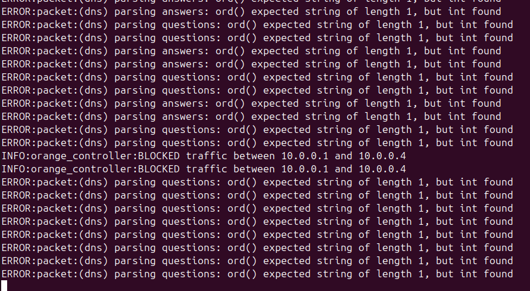
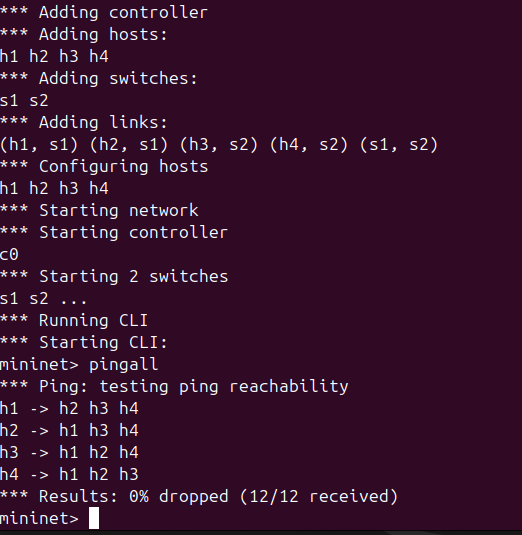
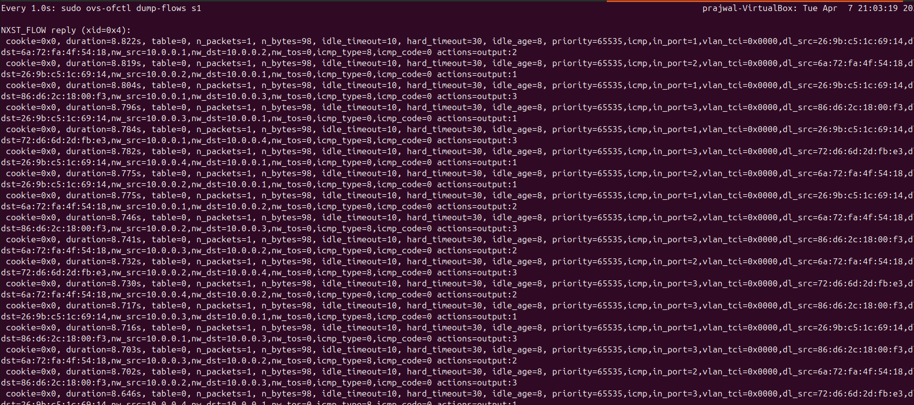
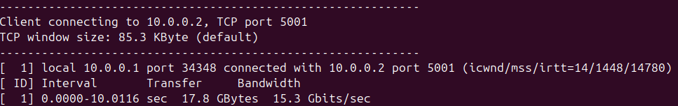
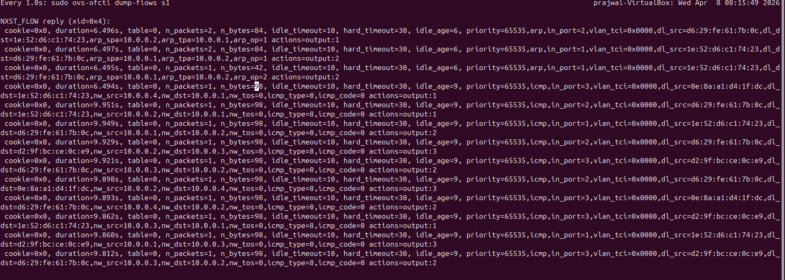
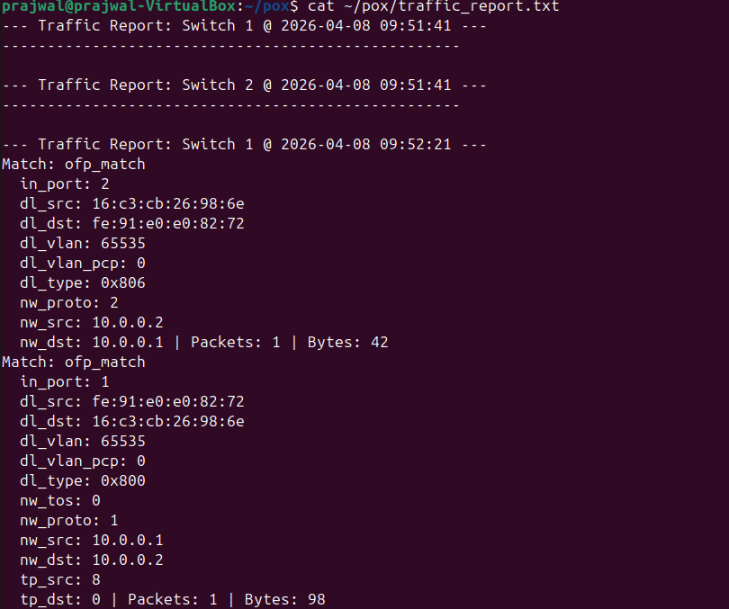
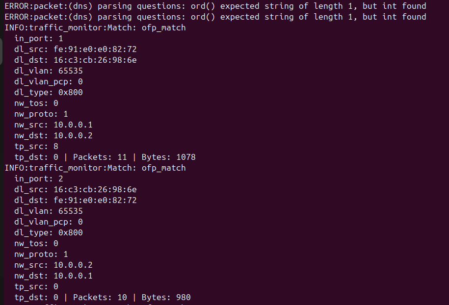

# SDN-Traffic-Monitoring-and-Statistics-Collector

## Problem Statement
The objective of this project is to implement a Software-Defined Networking (SDN) solution using Mininet and the POX OpenFlow controller. The project satisfies the "Orange Problem" requirements by demonstrating controller-switch interaction, custom flow rule design (match-action logic), and network behavior observation. 

Specifically, the implementation features:
1. **Access Control (Firewall):** A Layer 2 Learning Switch paired with an explicit rule to drop traffic between specific hosts (Allowed vs. Blocked).
2. **Network Resilience:** Observation of network behavior during a physical link disconnection and subsequent recovery (Normal vs. Failure).
3. **Traffic Monitoring & Statistics Collector:** A custom controller module that periodically requests flow statistics from switches, displays live packet/byte counts, and generates a traffic report.

## Network Topology
A custom Mininet topology was built using the `custom_topology.py` script:
* **Switches:** 2 Open vSwitch (OVS) nodes (`s1`, `s2`)
* **Hosts:** 4 Hosts (`h1`, `h2`, `h3`, `h4`)
* **Links:** `h1`-`s1`, `h2`-`s1`, `h3`-`s2`, `h4`-`s2`, and a trunk link between `s1`-`s2`.

## Setup and Execution Steps
**1. Start the Controller:**
Navigate to the POX directory. You can run either the main firewall controller or the traffic monitoring controller:
* For Firewall/Resilience testing: `python3 pox.py orange_controller`
* For Statistics gathering: `python3 pox.py traffic_monitor`

**2. Start the Mininet Topology:**
In a separate terminal, execute the custom topology script:
`sudo python3 custom_topology.py`

---

## Expected Output & Proof of Execution

### Scenario 1: Allowed vs. Blocked (Firewall Filtering)
The controller intercepts `PacketIn` events. Traffic between `10.0.0.1` (h1) and `10.0.0.4` (h4) is explicitly matched and dropped via a hard timeout rule with priority 100. All other traffic is handled by the standard L2 learning switch.
* **Pingall Results (Showing h1 to h4 failure):**
  
* **Controller Logs (Showing blocked traffic event):**
  

### Scenario 2: Normal vs. Failure (Link Resilience)
Simulating a physical cable disconnection between Switch 1 and Switch 2 (`link s1 s2 down`).
* **Link Down (Destination Host Unreachable):**
  
* **Link Up (Traffic Restored):**
  

### Performance Observation & Metrics
* **Throughput (iperf):**
  Bandwidth measurement between Host 1 and Host 2 showing continuous data transfer capabilities.
  
* **Flow Table Installation:**
  Proof of OpenFlow match-action rules dynamically pushed to Switch 1, including active packet counts.
  

### Traffic Monitoring & Statistics Collector
A custom POX module (`traffic_monitor.py`) periodically polls the switches every 10 seconds for flow statistics, actively displaying packet and byte counts, and saving them to a permanent report.
* **Live Periodic Monitoring:**
  
* **Generated Statistics Report:**
  [Click here to view the generated traffic_report.txt file](traffic_report.txt)

